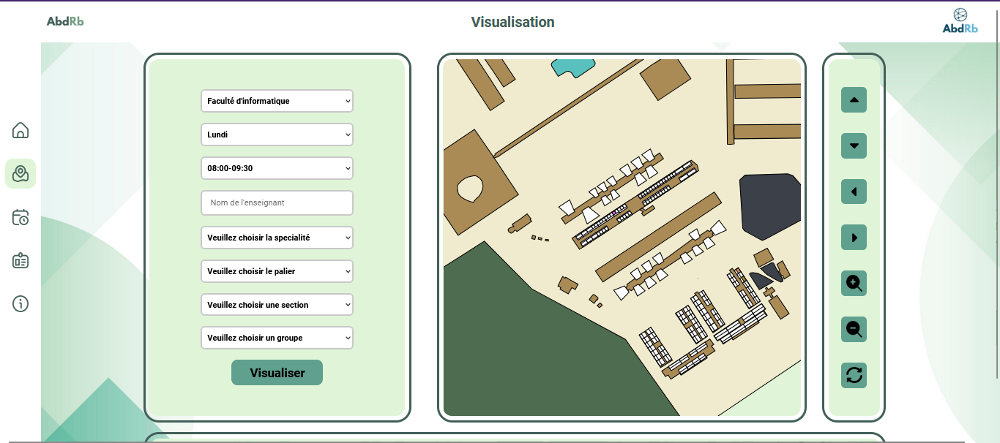
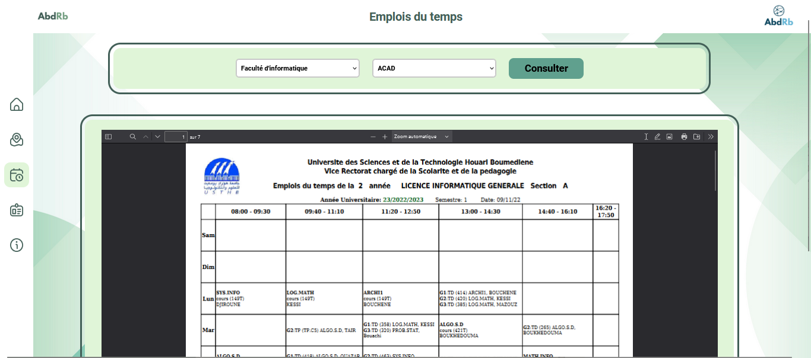
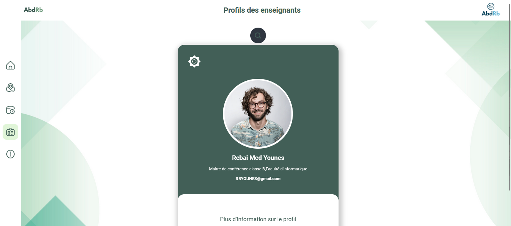
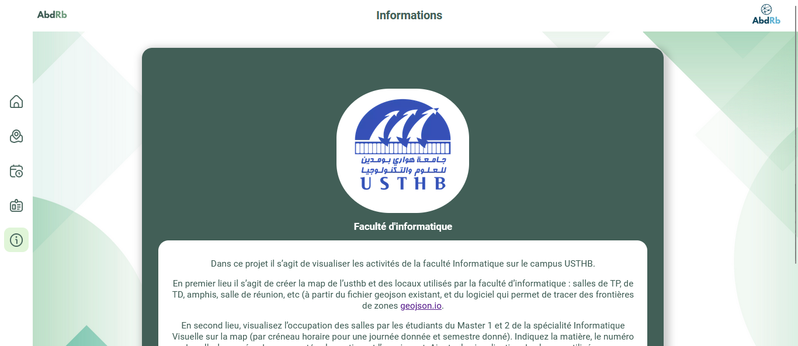

# USTHB Campus Visualization Project

This project aims to visualize the activities of the Faculty of Computer Science on the USTHB campus.

## Objective

1. **Map Creation**: Create a map of USTHB and the facilities used by the Faculty of Computer Science, including computer labs, lecture halls, meeting rooms, etc. This is achieved using existing geojson files and software capable of tracing zone boundaries (e.g., [geojson.io](https://geojson.io/#map=2/0/20)).

2. **Student Activities Visualization**: Visualize the occupancy of rooms by Master 1 and 2 students specializing in Visual Computing for a given semester and day, broken down by time slots. Display details such as the subject, room number, group/section number, and teacher.

3. **Teacher Visualization**: Implement a feature to visualize the rooms utilized by a given teacher.

4. **Events Visualization**: Display ongoing or planned events within the Faculty.

## Data Source

The data required for visualization is assumed to be provided in a CSV file.

## Additional Features

In addition to the initial objectives, time schedule consultation and teacher profiles have been implemented by the project contributors.

## Generalization

The visualization system proposed is intended to be generalized for use by all faculties.

## Some Screenshots

  
  
  
  
  

## Collaborators

- [@RB-Younes](https://github.com/RB-Younes)
- [@NaaaaaaaaaaDaa](https://github.com/NaaaaaaaaaaDaa)

🚀
